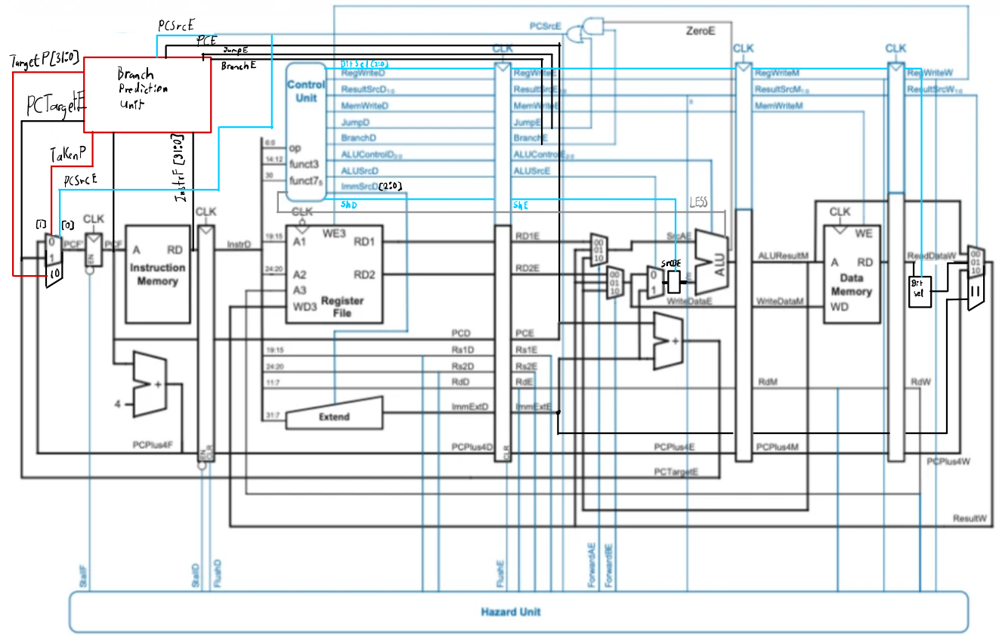

# Proyecto 3: Procesador Segmentado RV32I (5 etapas)
**Diseño de Sistemas Digitales EL-3310**
- Profesor: Dr.-Ing. Jorge Castro-Godínez.
- Estudiantes: Fabricio Mena Mejia, Julio David Quesada Hernández, Yair González Núñez.

---

## 1. Descripción general de la solución propuesta

El Proyecto 3 transforma el procesador **uniciclo RV32I del Proyecto 2** en una arquitectura **segmentada de 5 etapas** (*pipeline*), conservando intactos todos los módulos funcionales originales (ALU, Unidad de Control, Banco de Registros, memorias, etc.) y añadiendo únicamente los componentes necesarios para la segmentación.

La conversión al pipeline supone dividir la ejecución de cada instrucción en cinco fases solapadas:

```
IF → [IF/ID] → ID → [ID/EX] → EX → [EX/MEM] → MEM → [MEM/WB] → WB
```

Con este esquema, en régimen estacionario se ejecuta **una instrucción por ciclo** (frente al ciclo largo del diseño uniciclo), logrando un mayor rendimiento. El precio a pagar son los *hazards* de datos y de control, que se resuelven mediante las técnicas descritas a continuación.

 

### Cambios aplicados sobre el Proyecto 2

| Elemento | Acción |
|---|---|
| `ALU`, `control_unit`, `main_decoder`, `alu_decoder` | **Sin cambios** |
| `extend`, `reg_file`, `single_port_ram`, `BitSelector` | **Sin cambios** |
| `instructionMemory`, `pc.sv`, `pc_increment.sv` | **Sin cambios** |
| `top.sv` | Modificado para agregar Hazard Unit y los registros nuevos |
| `pipeline_regs.sv` | **Nuevo** – 4 registros de segmentación |
| `hazard_unit.sv` | **Nuevo** – Detección y resolución de hazards |

---

## 2. Módulos nuevos

### `pipeline_regs.sv`

Contiene los cuatro registros de pipeline que separan las etapas del procesador. Cada uno captura en el flanco positivo del reloj todas las señales de control y de datos que deben propagarse a la siguiente etapa.

#### `reg_IF_ID`
Separa **IF** de **ID**. Almacena la instrucción y el PC capturados al final de Instruction Fetch.

| Puerto | Dirección | Descripción |
|---|---|---|
| `stall` | entrada | Congela el registro (hazard load-use) |
| `flush` | entrada | Inserta NOP (salto tomado) |
| `PC_in / PCplus4_in / instr_in` | entrada | Valores de la etapa IF |
| `PC_out / PCplus4_out / instr_out` | salida | Valores visibles en ID |

#### `reg_ID_EX`
Separa **ID** de **EX**. Propaga todas las señales de control decodificadas y los operandos leídos del banco de registros.

Señales de control propagadas: `RegWrite`, `ResultSrc`, `MemWriteEn`, `MemWrite`, `ALUSrc`, `ALUControl`, `BitSel`, `Sh`, `Jump`, `Branch`.  
Datos propagados: `PC`, `PCplus4`, `rdata1`, `rdata2`, `imm`, `rd`, `rs1`, `rs2`, `opcode`, `funct3`.

Soporta `flush` para insertar una burbuja cuando se detecta un salto o un stall por load-use.

#### `reg_EX_MEM`
Separa **EX** de **MEM**. Propaga el resultado de la ALU, el segundo operando (para stores) y las señales de control de memoria y writeback.

Incluye el campo `imm_in / imm_out` (agregado respecto a la versión inicial) para que el inmediato de las instrucciones **LUI** llegue correctamente hasta la etapa WB y pueda escribirse en el banco de registros a través de `ResultSrc = 2'b11`.

#### `reg_MEM_WB`
Separa **MEM** de **WB**. Propaga el resultado de la ALU, el dato leído de memoria, `PCplus4`, el inmediato y las señales de control de escritura en registros.

---

### `hazard_unit.sv`

Detecta y resuelve los tres tipos de conflictos que surgen en el pipeline.

#### Forwarding (hazards de datos EX y MEM)

Cuando una instrucción en EX necesita un dato que aún no ha sido escrito de vuelta al banco de registros, la hazard unit lo redirige directamente desde el registro de pipeline correspondiente, sin detener el pipeline.

| `ForwardA / ForwardB` | Origen |
|---|---|
| `2'b00` | Dato del banco de registros (sin hazard) |
| `2'b10` | Resultado en EX/MEM (hazard EX) |
| `2'b01` | Dato en MEM/WB (hazard MEM) |

La prioridad es EX/MEM > MEM/WB. Los muxes de forwarding se insertan antes de las entradas de la ALU en la etapa EX, y también sobre `rdata2` para el caso de las instrucciones STORE.

#### Stall por load-use (1 ciclo de penalización)

Si la instrucción en EX es un **LOAD** (`ResultSrc[0] = 1`) y su `rd` coincide con el `rs1` o `rs2` de la instrucción que sigue en ID, el dato no está disponible hasta el final de MEM. En este caso:

- El PC y el registro `IF/ID` se **congelan** (no avanzan).
- Se inserta una **burbuja** en `ID/EX` (todos los controles a cero).

Esto introduce un ciclo de pausa, tras el cual el forwarding MEM→WB resuelve el conflicto de forma transparente.

#### Flush por salto (2 ciclos de penalización)

Los saltos y branches se resuelven al **final de la etapa EX** (cuando la ALU calcula la condición y el target). Para ese momento ya se han fetched 2 instrucciones incorrectas. Cuando `PCSrc_EX = 1`:

- El PC se redirige al target calculado.
- Se vacían `IF/ID` e `ID/EX` insertando NOPs.

---

### `top.sv`

Módulo top-level del procesador segmentado. Ahora `top.sv` instancia todos los módulos originales más los nuevos de pipeline.

**Estructura de señales por etapa:**

```
IF   : PC_IF, PCplus4_IF, instr_IF
ID   : PC_ID, PCplus4_ID, instr_ID, rdata1_ID, rdata2_ID, imm_ID, señales de control
EX   : PC_EX, PCplus4_EX, ALUin0/1, ALUResult_EX, ALUFlags_EX, PCSrc_EX, PCTarget_EX
MEM  : ALUResult_MEM, rdata2_MEM, mem_rdata_MEM, ram_we
WB   : writeback_data_WB → banco de registros
```

Diferencias clave respecto a `top.sv`:

1. **PC con enable de stall**: el registro PC ya no está dentro de `pc_increment`; se instancia directamente con un `always_ff` que incluye la condición `!stall`.
2. **Muxes de forwarding**: antes de las entradas `a` y `b` de la ALU se añaden muxes 3:1 controlados por `ForwardA` y `ForwardB`.
3. **`PCSrc` se recalcula en EX**: la lógica de `BranchTaken` (antes en `control_unit`) se replica en la etapa EX usando los `ALUFlags` reales del ciclo actual.
4. **Inmediato propagado hasta WB**: el campo `imm` viaja a través de `ID/EX → EX/MEM → MEM/WB`, corrigiendo el bug donde LUI escribía `0x00000000` en lugar del inmediato superior.
5. **`BitSel` y `ALUResult[1:0]` en WB**: se propagan con registros FF locales para el desplazamiento y formateo correcto de los datos leídos de memoria (instrucciones `lb`, `lh`, `lbu`, `lhu`).

---

## 3. Correcciones aplicadas durante la integración

### Bug: LUI escribía cero en el registro destino

**Síntoma:** La instrucción `LUI x2, 0x00012` dejaba `x2 = 0x00345678` en lugar de `0x00012000 + offset`. El byte superior construido con LUI se perdía.

**Causa raíz:** El registro `reg_EX_MEM` no tenía puertos `imm_in / imm_out`. Al llegar a la etapa MEM, el inmediato era `32'b0`. En `top.sv` la conexión original decía literalmente `.imm_in(32'b0)`.

**Solución:**
1. Se añadieron los puertos `imm_in` / `imm_out` a `reg_EX_MEM` en `pipeline_regs.sv`.
2. Se conectó `imm_EX` (salida de `reg_ID_EX`) a la entrada `imm_in` de `reg_EX_MEM`.
3. Se conectó `imm_MEM` (salida de `reg_EX_MEM`) a la entrada `imm_in` de `reg_MEM_WB`.

Con este fix, la cadena completa `imm_ID → imm_EX → imm_MEM → imm_WB` queda conectada y `ResultSrc = 2'b11` funciona correctamente para LUI.

---

## 4. Programas de prueba

Los mismos dos programas del Proyecto 2 se utilizan para validar el procesador segmentado. El testbench `tb_top.sv` es idéntico en estructura al original, con las siguientes adaptaciones:

- Los paths de acceso jerárquico apuntan a `u_top.regs.regs[N]` y `u_top.data_mem.ram[N]` (sin cambio de nombres).
- Se añaden **~5 ciclos de margen** sobre el número original de ciclos de espera, para compensar la latencia de llenado del pipeline (4 ciclos la primera instrucción).
- Las verificaciones se toman en flanco negativo (`negedge clk`) para garantizar que la escritura del ciclo actual ya se estabilizó.

### Programa 1: *Manipulación Aritmética y Memoria Parcial*

Igual que en el Proyecto 2. Construye `0x12345678` en pasos (LUI + ADDI + ORI + SLLI), realiza stores y loads parciales (byte/halfword), operaciones de shift, comparaciones con signo/sin signo y ramas condicionales. Finaliza en loop infinito (JAL).

### Programa 2: *Conjetura de Collatz*

Igual que en el Proyecto 2. Explota JAL/JALR y branches condicionales para calcular los pasos de Collatz partiendo de N=7.

---

## 5. Ejecución de testbenches individuales

Cada módulo posee un script shell (`run_*.sh`) que compila y ejecuta su testbench correspondiente de forma aislada. Esto permite verificar el funcionamiento correcto de cada componente antes de integrarlo en el procesador completo.

### Scripts disponibles

| Módulo | Script | Ubicación | Ejecución |
|---|---|---|---|
| ALU | `run_ALU.sh` | `ALU/` | `cd ALU && ./run_ALU.sh` |
| BitSelector | `run_BitSelector.sh` | `BitSelector/` | `cd BitSelector && ./run_BitSelector.sh` |
| ControlUnit | `run_ControlUnit.sh` | `ControlUnit/` | `cd ControlUnit && ./run_ControlUnit.sh` |
| Extend | `run_Extend.sh` | `Extend/` | `cd Extend && ./run_Extend.sh` |
| Flops (Pipeline Regs) | `run_Flops.sh` | `Flops/` | `cd Flops && ./run_Flops.sh` |
| HazardUnit | `run_HazardUnit.sh` | `HazardUnit/` | `cd HazardUnit && ./run_HazardUnit.sh` |
| Memory | `run_Memory.sh` | `Memory/` | `cd Memory && ./run_Memory.sh` |
| PC | `run_PC.sh` | `PC/` | `cd PC && ./run_PC.sh` |
| RegisterFile | `run_RegisterFile.sh` | `RegisterFile/` | `cd RegisterFile && ./run_RegisterFile.sh` |
| BranchPredictor | `run_BranchPredictor.sh` | `BranchPredictor/` | `cd BranchPredictor && ./run_BranchPredictor.sh` |

### Prueba completa del procesador

Para ejecutar todos los módulos de una sola vez, incluyendo los programas de prueba (`Prog1_Math` y `Prog2_Collatz`), se proporciona un script maestro:

```bash
cd /home/iquick/DSD/P3/P3_DSD
./run_tests.sh
```

Este script ejecuta secuencialmente los testbenches de todos los módulos individuales y los dos programas integrados, generando un reporte final con el conteo de módulos que pasaron y fallaron.

### Ejemplo de ejecución individual

```bash
# Ejecutar solo el testbench de la ALU
$ cd ALU
$ ./run_ALU.sh
Compilando tb_ALU -> ./tb_ALU.sv ./ALU.sv ...
<salida del simulador>
TODOS LOS TESTS PASARON

# Ejecutar solo el testbench del HazardUnit
$ cd ../HazardUnit
$ ./run_HazardUnit.sh
<salida del simulador>
```

### Archivos generados durante la ejecución

Cada ejecución genera los siguientes archivos temporales:

- `/tmp/tb_out` — Ejecutable compilado (binario vvp)
- `/tmp/warn.log` — Log de warnings/errores de la compilación
- `*.vcd` — Archivos de traza de señales (útiles para debugging con GTKWave)

---

## 6. Discusión de resultados

- El pipeline de 5 etapas ejecuta correctamente las 37 instrucciones RV32I implementadas.
- El forwarding elimina la mayoría de las penalizaciones de hazards de datos, introduciendo latencia adicional solo en el caso load-use (1 ciclo).
- Los saltos y branches penalizan 2 ciclos (instrucciones fetched de más que se descartan con flush).
- La corrección del bug de LUI fue esencial: sin propagar el inmediato a través de EX/MEM, todas las instrucciones que dependen de una carga de inmediato superior fallaban silenciosamente.
- Los programas Prog1 (aritmética) y Prog2 (Collatz) producen los mismos resultados que en el procesador uniciclo, validando la equivalencia funcional de ambas implementaciones.
